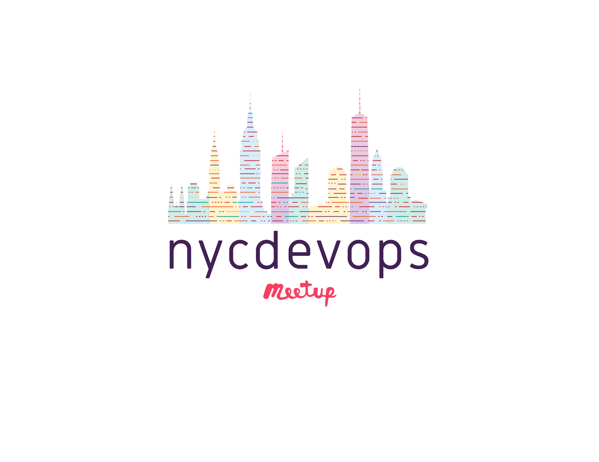

# nycdevops planners wiki

# Quick Links and Resources

* The meetup page: [http://www.meetup.com/nycdevops](http://www.meetup.com/nycdevops)
* Meeting Planning [spreadsheet](https://docs.google.com/spreadsheets/d/1ADyrpX3PK-etBq4M_KhdLC9COet39Vuy5caeIA6OyTc/edit)
* Mailing list:
  * Main Page: [https://groups.google.com/forum/#!aboutgroup/nycdevops-planners](https://groups.google.com/forum/#!aboutgroup/nycdevops-planners)
  * Subscribe: [https://groups.google.com/forum/#!forum/nycdevops-planners](https://groups.google.com/forum/#!forum/nycdevops-planners)
* Slack: [https://nycdevops.slack.com](https://nycdevops.slack.com)

# Current Organizers and roles:</h2>
  * Nicole Johnson: Lead Coordinator, Sponsor coordinator.
  * Tom Limoncelli: Logistics for meetings at StackOverflow HQ. 
  * (add yourself here!) 
 
# Onboarding checklist for new planners:

  * Join the Meetup.com group.
  * Join the nycdevops-planners mailing list.
  * Join the Slack channel.
  * Get read/write access to this wiki (let Tom know your GitHub handle)
  * Make sure you have access to the planning spreadsheet. 
  * Add your name to this web page.
  * Email Nicole and ask for admin access to the meetup. 

# Runbook for planning events:

  * Prior to the event:
    * Reach out to the host and confirm the location. 
  * When the **speaker is confirmed:**
    * Update meetup.com. Announce the meeting.
    * Post on everythingsysadmin.com NOW
    * Post on everythingsysadmin.com scheduled for 1 week prior.
    * Send ticket to Stack A/V people that we'll need help.
  * *1 week before:*
    * Re-announce 
  * Day before: *Order food.*
    * Count RSVPs. Assume 50% will show up. 
    * Order 1 pizza for every 10 likely attendees.
    * StackHQ:
      * http://www.undergroundpizza.com
      * 6 pizzas (3 plain, 2 pepperoni, 1 sausage) for 60 RSVPs 
      * https://www.newyorkgrocery.com
      * 2 x 2L coke, 2x 2L coke zero, 2x 2L sprite for 60 RSVPs. 
      * Heinekin Light Slim Can 12pk | Sam Adams Summer Ale 12pk Cans | Stone Delicious IPA 12pk 

# Logos

  * [EPS](images/NYCDevOps_logo2017.eps)
  * high-res [JPG](images/NYCDevOps_logo2017_hires.jpg)
  * low-res [JPG](images/NYCDevOps_logo2017_lores.png)

# Sponsors:

  * If anyone asks: Yes, we're always looking for sponsors. 
  * Sponsors are on a first come, first served basis.  First person to mark [the spreadsheet](https://docs.google.com/spreadsheets/d/1ADyrpX3PK-etBq4M_KhdLC9COet39Vuy5caeIA6OyTc/edit) is the  sponsor.

# Speaker tips

This is what we paste in an email to speakers:

Sorry for the form letter style of this but... here are some notes and tips that we've found help make a successful event:

* We ask speakers to keep the talk to about 30-40 minutes, with 20 minutes for Q&A.  Our attendees enjoy the dialog.
* Our attendees are very technical. Don't hold back the technical info. No sales pitches.
* The most successful presentations have at least one rehearsal in front of a live audience to give feedback.  We recommend doing the talk for coworkers prior to the event.  Alternatively we have volunteers that would gladly do a rehearsal with you over video chat; they give excellent feedback.  
* In the unlikely event that a problem arises and you might not be able to make the presentation, please let us know as early as possible.

I'm super excited about the talk and look forward to seeing you in MONTH!
